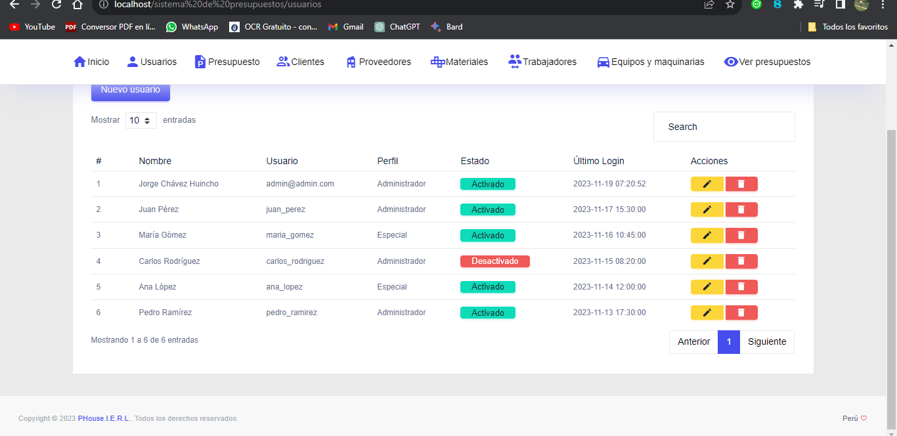
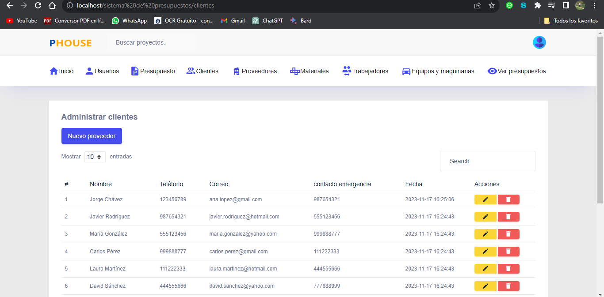
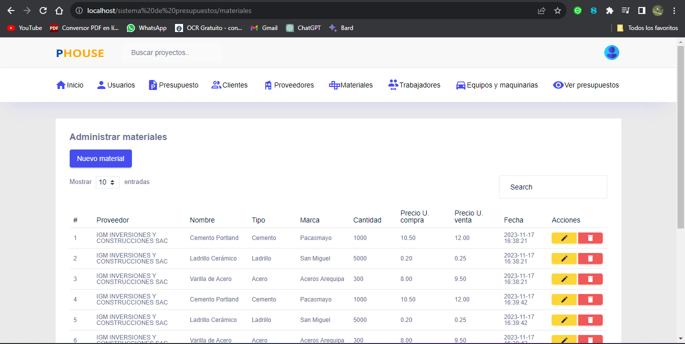
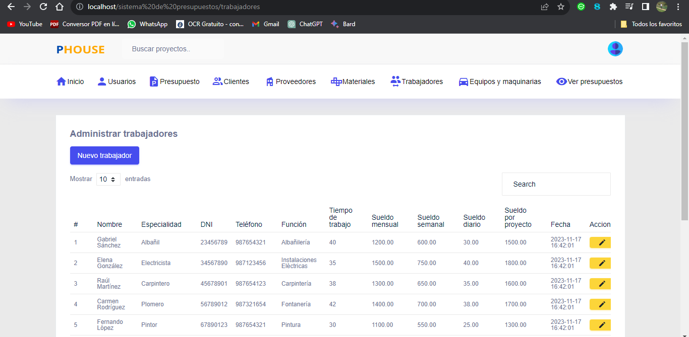
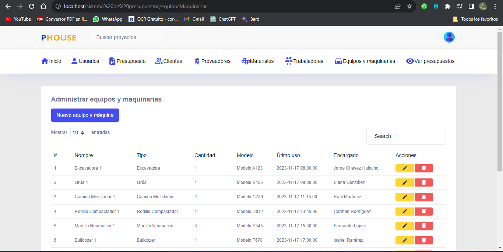
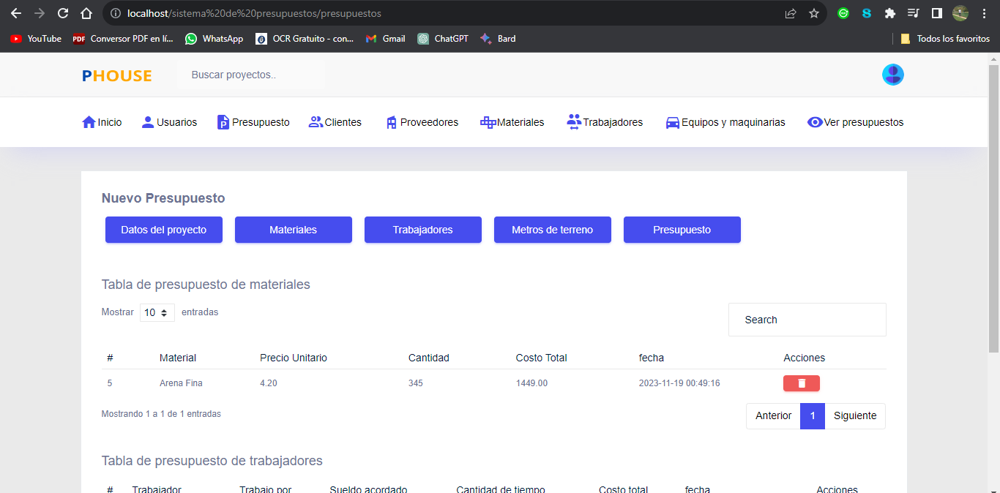
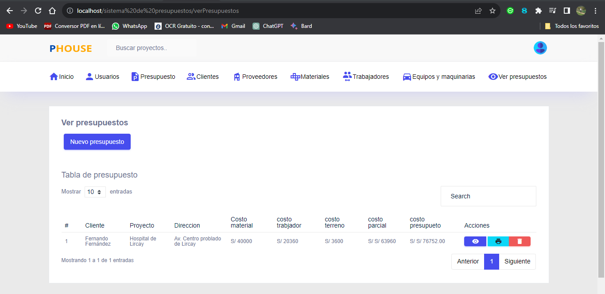
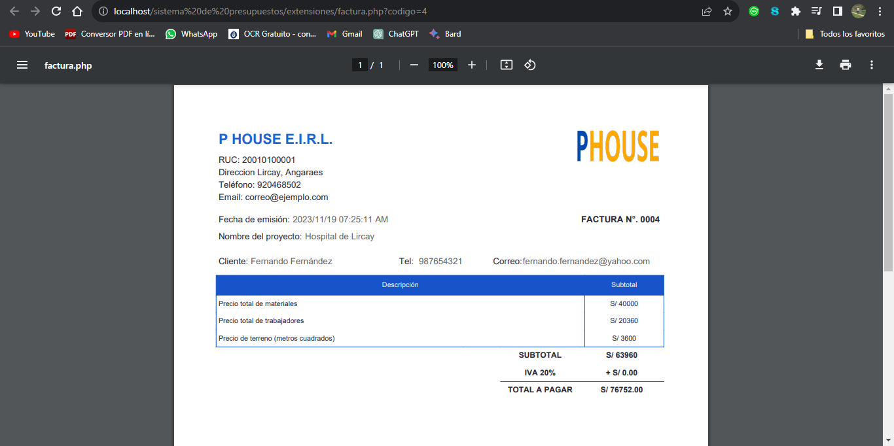

##Sistema de calculadora de presupuestos

El Sistema de Calculadora de Presupuestos es una aplicación web desarrollada utilizando PHP y MySQL para gestionar y calcular presupuestos de manera eficiente. La aplicación proporciona una interfaz fácil de usar para que los usuarios ingresen detalles relacionados con proyectos y obtengan estimaciones precisas de los costos asociados. A continuación, se presenta una breve descripción de las características clave del sistema:

##### Características Principales:

###### Inicio de Sesión y Registro de Usuarios:

Los usuarios pueden crear cuentas y acceder al sistema mediante un proceso de inicio de sesión seguro.
###### Panel de Usuario:

Cada usuario tiene un panel personalizado que muestra sus proyectos actuales y anteriores.
###### Gestión de Proyectos:

Permite a los usuarios crear, editar y eliminar proyectos.
Para cada proyecto, se pueden especificar detalles como nombre, descripción y fecha de inicio.
###### Desglose de Costos:

Los usuarios pueden agregar diferentes ítems y servicios asociados con el proyecto, asignando costos individuales.
Se proporciona la capacidad de clasificar los costos por categorías, como materiales, mano de obra, etc.
###### Cálculo Automático de Presupuesto:

La aplicación realiza cálculos automáticos basados en los costos ingresados, proporcionando un total estimado del presupuesto.
###### Almacenamiento en la Base de Datos:

La información del proyecto, los costos y otros detalles relevantes se almacenan de manera segura en una base de datos MySQL.
###### Historial de Presupuestos:

Los usuarios pueden revisar el historial de presupuestos de proyectos anteriores y realizar análisis comparativos.
###### Generación de Informes:

Se proporciona la capacidad de generar informes detallados en formato PDF o CSV para facilitar la revisión y el intercambio de información.
###### Tecnologías Utilizadas:

Frontend: HTML, CSS, JavaScript
Backend: PHP
Base de Datos: MySQL
Seguridad:

La aplicación implementa medidas de seguridad, como la validación de datos de entrada y el uso de consultas preparadas para prevenir ataques de inyección SQL.
Este sistema de calculadora de presupuestos está diseñado para ser una herramienta práctica y eficaz para la gestión de costos en proyectos, brindando a los usuarios la capacidad de planificar y controlar sus presupuestos de manera efectiva.

### Requisitos
HTML y CSS.
PHP 8.0 | 8.2.
 MySQL.
 
###  Instalación
```bash
git clone https://github.com/yorchavez9/sis_calculadora_presupuestos.git
cd tuproyecto
npm install```

### Configuración

Base de datos: **db_presupuesto.sql**

Cambiar el nombre de la base de datos **sis_presupuesto**: 


```<?php
class Conexion{
    static public function conectar(){
        $link = new PDO("mysql:host=localhost;dbname=sis_presupuesto",
                        "root",
                        "");
        $link->exec("set names utf8");
        return $link;
    }
}
<?php
```
### Vistas previas del sistema 

Inicio del sistema/parte cliente


> Inicio del sistema.


Inicio de sesión del sistenma, primero tiene que registrarse


> Inicio de sesión del sistenma, primero tiene que registrarse.


Administrador de inicio del sistema


> Administrador de inicio del sistema.


Administrador de usuarios


> Administrador de usuarios.


Administrador de clientes


> Administrador de clientes.


Administrador de proveedores


> Administrador de proveedores.


Administrador de clientes


> Administrador de clientes.


Administrador de trabajadores


> Administrador de trabajadores.


Administrador de equipos


> Administrador de equipos.


Nuevo presupuesto


> Nuevo presupuesto.

Ver presupuestos


> Ver presupuestos.


Reporte


> Reporte.


